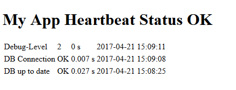
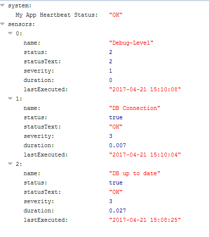

How to Use
==========

Controller
----------

The heartbeat status page can be accessed via /heartbeat, e.g. http://www.example.com/heartbeat or http://localhost/my_app/heartbeat.
It will display a table of all the registered and enabled sensors and their status, as well as the overall status of your application, based on the status of the sensors:

Or, if you use a basic bootstrap layout instead (look at the [Configuration](Configuration.md) for a guide on how to change the layout):

The data can also be requested as JSON for further processing, just add .json to the URL e.g. http://www.example.com/heartbeat.json:

To force the status page to load without caching, you can add 'reset-cache=true' to the URL e.g. http://www.example.com/heartbeat?reset-cache=true.

Shell
-----

TODO

---

Back to the [Documentation](Home.md).
